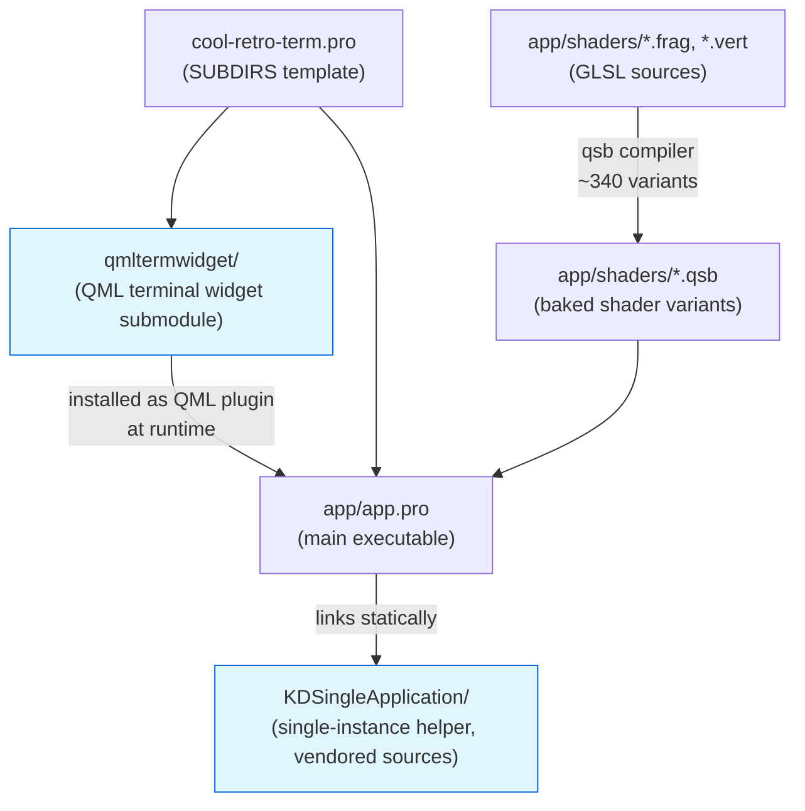
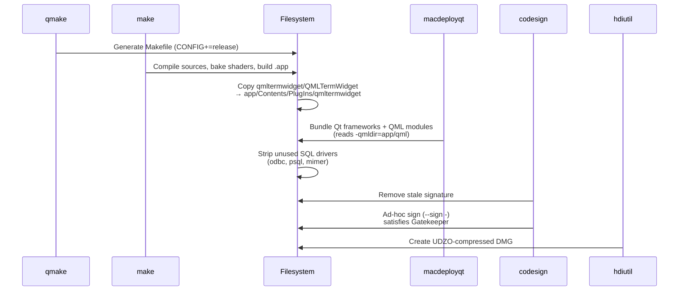
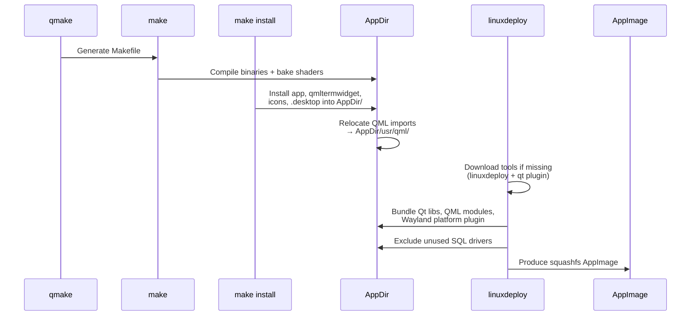
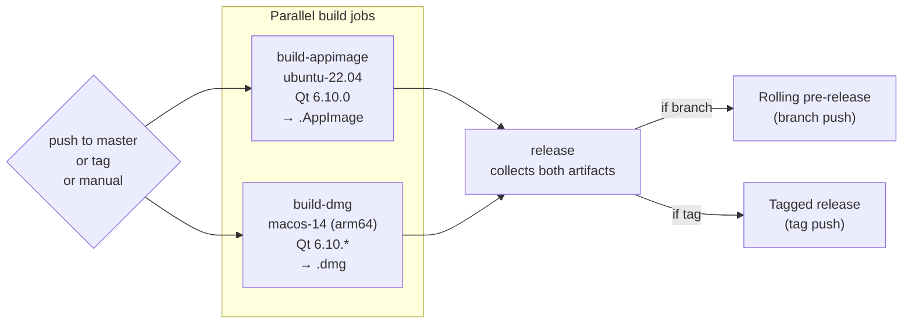

# Building cool-retro-term

This document covers building cool-retro-term from source on every officially supported platform. The official wiki pages are out of date (they reference Qt5 — the project now requires Qt6).

## Supported platforms

| Platform | Toolchain | Distributable artifact | Build script |
|---|---|---|---|
| macOS (Apple Silicon & Intel) | Qt 6.10, clang, qmake | `.app` bundle, `.dmg` | [scripts/build-dmg.sh](../scripts/build-dmg.sh) |
| Linux (x86_64) | Qt 6.10, gcc, qmake | `.AppImage` | [scripts/build-appimage.sh](../scripts/build-appimage.sh) |

The same `qmake` build is used everywhere — only the packaging step differs.

## Requirements (all platforms)

- **Qt 6.10+** with the following extra modules:
  - `qt5compat` — required by qmltermwidget submodule
  - `qtshadertools` — provides `qsb`, the shader baker invoked from [app/app.pro:46](../app/app.pro#L46)
- A C++17 compiler (clang on macOS, gcc on Linux)
- Git (the build embeds `git describe` output as the version string at [app/app.pro:3](../app/app.pro#L3))

## Project layout



The two git submodules (`qmltermwidget`, `KDSingleApplication`) are populated automatically when you clone with `--recursive`. If you forgot, run:

```bash
git submodule update --init --recursive
```

## macOS

### Option A — install a prebuilt binary

```bash
brew install --cask cool-retro-term
# or
sudo port install cool-retro-term
```

### Option B — build from source

Install Qt 6.10+ via Homebrew:

```bash
brew install qt
```

Then build and run:

```bash
export PATH="$(brew --prefix qt)/bin:$PATH"
cd /path/to/cool-retro-term

qmake CONFIG+=release
make -j"$(sysctl -n hw.ncpu)"

# QML plugin must live inside the bundle for the app to find it
mkdir -p cool-retro-term.app/Contents/PlugIns
cp -R qmltermwidget/QMLTermWidget cool-retro-term.app/Contents/PlugIns/qmltermwidget

open cool-retro-term.app
```

### Option C — build a distributable DMG

The repo ships a script that runs the full bundle/sign/package pipeline:

```bash
export PATH="$(brew --prefix qt)/bin:$PATH"
./scripts/build-dmg.sh
```

The DMG assembly flow (from [scripts/build-dmg.sh](../scripts/build-dmg.sh)):



The output is named `cool-retro-term-<version>.dmg` in the directory you ran the script from.

## Linux

### Option A — install from your distro

cool-retro-term is packaged in most major repositories:

| Distro | Command |
|---|---|
| Ubuntu / Debian | `sudo apt install cool-retro-term` |
| Fedora | `sudo dnf install cool-retro-term` |
| Arch | `sudo pacman -S cool-retro-term` |
| openSUSE | `sudo zypper install cool-retro-term` |

> The `packaging/debian` and `packaging/rpm` files in this repo are legacy (Qt5-era) and are not used by upstream distro maintainers anymore — the distros maintain their own Qt6 packaging.

### Option B — install a prebuilt AppImage

Download the latest `.AppImage` from the [Releases page](https://github.com/Swordfish90/cool-retro-term/releases), `chmod +x` it, and run.

### Option C — build from source

Install Qt 6.10+ and a build toolchain. On Ubuntu 22.04+:

```bash
sudo apt install build-essential rsync wget
# Then install Qt 6.10 from the Qt online installer or aqt:
#   https://download.qt.io/official_releases/online_installers/
# Required modules: qt5compat, qtshadertools

export PATH="$HOME/Qt/6.10.0/gcc_64/bin:$PATH"   # adjust to your install
```

Build and run locally:

```bash
qmake
make -j"$(nproc)"
./cool-retro-term
```

### Option D — build an AppImage

```bash
export PATH="$HOME/Qt/6.10.0/gcc_64/bin:$PATH"
./scripts/build-appimage.sh
```

The AppImage assembly flow (from [scripts/build-appimage.sh](../scripts/build-appimage.sh)):



Output is `cool-retro-term-<version>.AppImage` in the directory you ran the script from.

## CI / release pipeline

The single workflow at [.github/workflows/release.yml](../.github/workflows/release.yml) drives both rolling and tagged releases:



The macOS job runs on `macos-14` (Apple Silicon), so DMG releases are arm64-native. There is no Intel-mac CI build — Intel users should build from source or use Homebrew.

## Troubleshooting

| Symptom | Cause | Fix |
|---|---|---|
| `qsb: command not found` during `make` | `qtshadertools` module missing | Reinstall Qt with `qtshadertools` selected |
| Compile fails referencing `Qt5Compat` | `qt5compat` module missing | Reinstall Qt with `qt5compat` selected |
| App launches but shows blank window | QMLTermWidget plugin not found at runtime | Ensure the plugin was copied into the bundle (macOS) or `QML2_IMPORT_PATH` is set (Linux dev runs) |
| `qmake not found` | Qt `bin/` not on PATH | `export PATH=...` as shown in the platform sections above |
| `git describe` returns "unknown" version | Cloned without tags or as a shallow clone | `git fetch --tags --unshallow` |
| First build is extremely slow | Shader baker compiles ~340 variants on first build | Expected; subsequent incremental builds are fast |

## Why so many shader variants?

[app/app.pro:62-94](../app/app.pro#L62-L94) generates a Cartesian product of CRT effect flags (raster mode × burn-in × frame × chroma, then RGB shift × bloom × curvature × shine). Compiling all variants up-front lets the renderer pick the right `.qsb` at runtime without an expensive shader recompile when settings change. The cost is paid once at build time.
